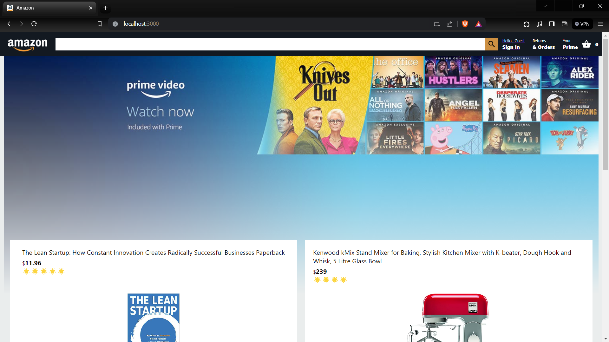
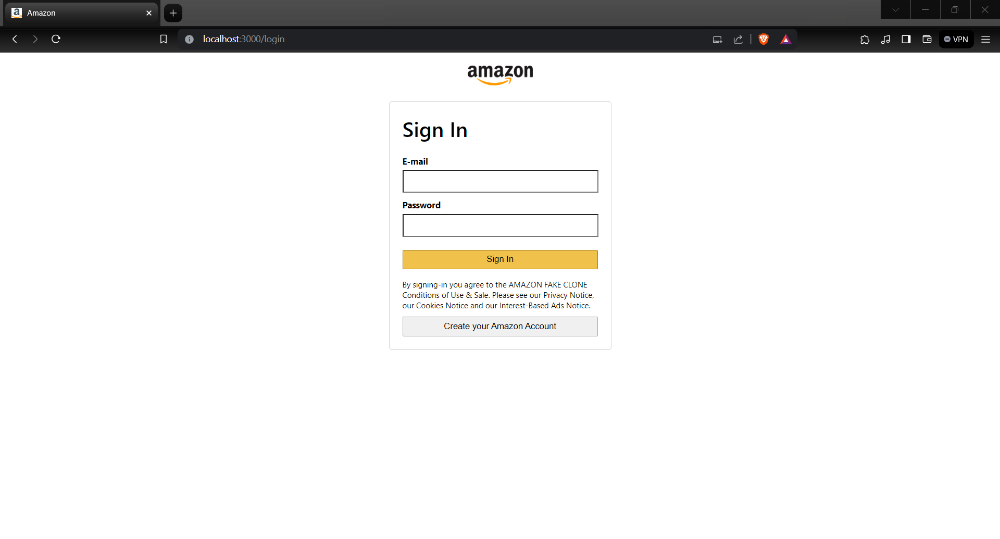
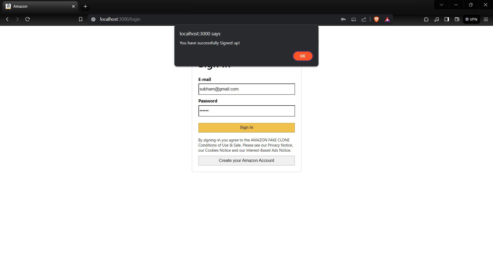
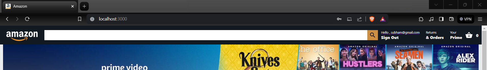
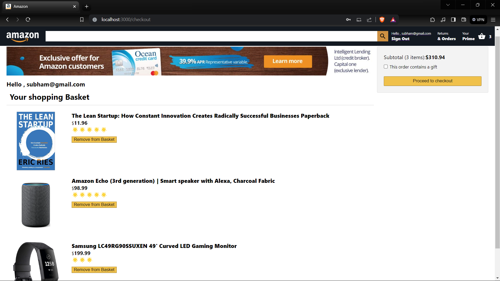
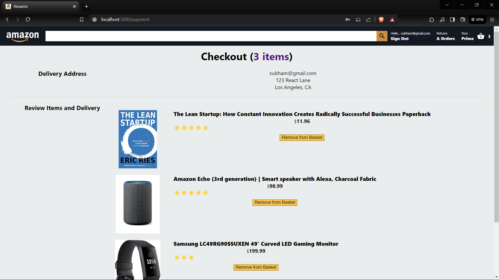
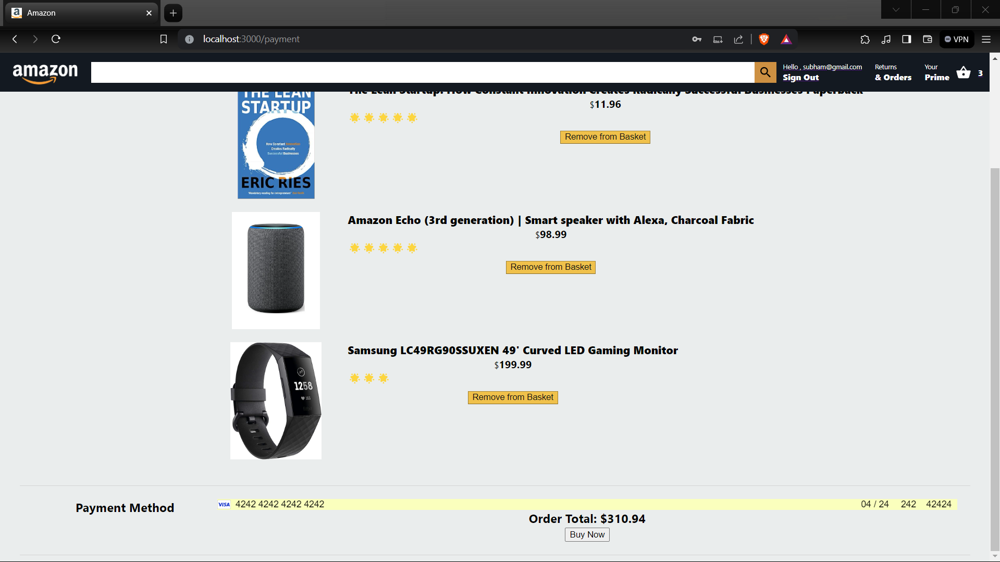

# Amazon-clone
This project is a full-stack e-commerce platform developed with the React, Node.js, Express.js and Firebase for user authentication. It faithfully replicates Amazon's features, including product browsing, cart management, and a secure checkout experience. Notably, the integration of Stripe ensures seamless and reliable payment processing. This project serves as a comprehensive showcase of modern web development technologies, offering a practical and functional Amazon-like shopping experience.

# Tech We Used
- ReactJs
- Firebase Hosting
- Firebase Auth
- Firebase Storage
- React-Dom
- React Redux
- Stripe payment

# Features
- Login and Logout
- Add to cart
- Remove from cart
- Payment
- Neat and clean UI

# SCREENSHOTS
- HOME PAGE

- SIGNUP PAGE

- SIGNUP SUCCESS PAGE

- USER SIGNED IN SUCCESSFULLY

- ITEM ADDED

- CHECKOUT PAGE

- PAYMENT PAGE

